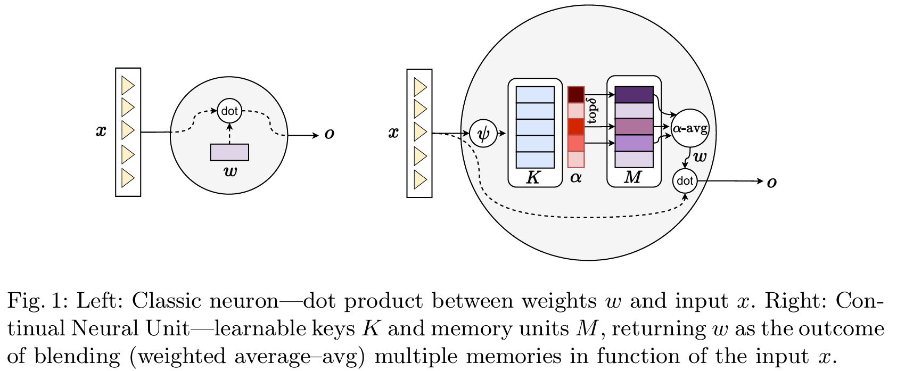

<div align="center">
  
  <div>
  <h1>Continual Neural Computation</h1>
  </div>

  <div>
      Matteo Tiezzi &emsp; Simone Marullo &emsp; Federico Becattini &emsp;  Stefano Melacci
  </div>
  <br/>

</div>


This repo contains the PyTorch code for ECML-PKDD 2024 paper "[Continual Neural Computation](https://link.springer.com/chapter/10.1007/978-3-031-70344-7_20)".





QUICK START: defining a Continual Neural Unit (CNU)
--------------------------
Have a look at the [Colab Notebook](https://github.com/mtiezzi/continual_neural_unit/blob/main/example_cnu.ipynb) for a complete example on how to define and use the Memory Head!


USAGE EXAMPLE
-------------

A very tiny example. If you would create a vanilla Linear layer in PyTorch as follows:

        net = nn.Sequential(
            nn.Linear(in_features=d, out_features=10, bias=True),
            nn.Tanh(),
            nn.Linear(in_features=10, out_features=c, bias=True)
        ).to(device)


Then, you can easily define and use a layer composed by Continual Neural Units (with the online K-means update procedure described in the main paper) as follows:

        net = nn.Sequential(
            nn.Linear(in_features=d, out_features=10, bias=True),
            nn.Tanh(),
            CNULinear(in_features=10, out_features=c, bias=True,
                    key_mem_units=10,
                    upd_m="WTA",  # choices=["vanilla", "WTA"]
                    upd_k="ad_hoc_WTA",  # choices=["ad_hoc_WTA", "grad_WTA", "grad_not_WTA"]
                    beta_k=0.01,
                    gamma_alpha=25.0, tau_alpha=0.95,
                    tau_mu=50,
                    tau_eta=50, scramble=True,
                    delta=2,
                    distance="euclidean",  # choices=["cosine", "euclidean", "dot_scaled"]
                    )
        ).to(device)


CODE REPOSITORY CONTENTS
------------------------
The code repository is composed by the following files and folders:

    cnu :                 folder containing the source code of our cnu model
    competitors :                   source folder for the implementation of continual learning baselines and competitors  
    d2d :                   folder containing 2D datasets (MODES, MOONS in the paper) generators and utils
        check_2d_datasets.py:   file for checking the shapes of the built 2d datasets
        generate_2d_datasets.py:   file for the customizable creation of the 2D datasets
        utils_2d_datasets.py : code utils for handling the 2D datasets 
    datasets :              folder containing the non-stationary imagenet dataset files    
    main.py :             experiments runner
    best_cnu_runs.txt :   command lines (and parameters) to reproduce the main results

DATASETS GENERATION
-------------------

The datasets needed for the experimental campaign can be generated with the provided code, that is described in the
following.

### 2D datasets

We share the code to generate the MODES and MOONS datasets described in the main paper in
the `d2d/generate_2d_datasets.py` file. The user can decide the number of samples, the class sample ratio, the
distributions shape and centers. The script handles the creation of all the CL settings described in the paper (*CI*; *CDI*, *CDID*).
The script must be runned in order to create the data needed for running the experiments.  Once created, the datasets will be placed in 
`d2d/generated_datasets`.
The `d2d/check_2d_datasets.py` script helps in better visualizing the created data.   

### Non-stationary Imagenet

We followed the data setting proposed in "Online continual learning in image classification: An empirical
survey" [Mai et al., 2022] using a subset of 100 class categories, following three distributions (original, small amount
of noise, large amount of noise). Data can be downloaded
from [KAGGLE](https://www.kaggle.com/account/login?titleType=dataset-downloads&showDatasetDownloadSkip=False&messageId=datasetsWelcome&returnUrl=%2Fdatasets%2Fwhitemoon%2Fminiimagenet%3Fresource%3Ddownload)
and placed in the folder:

```
datasets/mini_imagenet/
```

Perturbed versions of the dataset are going to be generated automatically and cached on disk at the first run or
the `main.py` script (see below for usage details).


RUNNING EXPERIMENTS
-------------------

We tested our code with `PyTorch 1.10`. Please install the other required dependencies by running:

```
pip install -r requirements.txt
```

We provide a `main.py`script to easily test the proposed model. The PyTorch device is chosen through the `--device`
argument (`cpu`, `cuda:0`,
`cuda:1`, etc.).
Remember to firstly generate the datasets following the instructions available in Section *DATASETS GENERATION*. 


    usage: main.py [-h] [--model {lp,mlp,cnu}] [--bias BIAS] [--watch WATCH] [--simple SIMPLE] [--hidden HIDDEN]
               [--benchmark {bi-modals_IID,bi-modals_CI,bi-modals_CDI,bi-modals_CDID,bi-moons_IID,bi-moons_CI,bi-moons_CDI,bi-moons_CDIDimagenet}] [--beta_m BETA_M] [--beta_k BETA_K] [--weight_decay WEIGHT_DECAY]
               [--optimizer OPTIMIZER] [--loss {xent,hinge}] [--wandb WANDB] [--key_mem_units KEY_MEM_UNITS] [--delta DELTA] [--psi {identity,sign}] [--key_size KEY_SIZE] [--gamma_alpha GAMMA_ALPHA] [--tau_alpha TAU_ALPHA]
               [--tau_mu TAU_MU] [--tau_eta TAU_ETA] [--upd_m {vanilla,WTA}] [--upd_k {ad_hoc_WTA,grad_WTA,grad_not_WTA}] [--scramble SCRAMBLE] [--shared_keys SHARED_KEYS] [--draw_plots DRAW_PLOTS] [--seed SEED] [--device DEVICE]
               [--competitor COMPETITOR] [--buffer_size BUFFER_SIZE] [--buffer_batch_size BUFFER_BATCH_SIZE] [--gdumb_epochs GDUMB_EPOCHS] [--ensembled_models ENSEMBLED_MODELS] [--eval_chunk_size EVAL_CHUNK_SIZE]

Argument description/mapping with respect to the paper notation:

      --model  : the neural architecture to be used
      --bias BIAS : boolean Flag for the use of bias weights
      --watch WATCH : wand watch model
      --hidden HIDDEN : amount of neurons in the hidden layer (for mlp only )
      --benchmark  : the dataset to be used; the 2D datasets are referred to as bi-modals (MODES in the paper), and bi-moons (MOONS in the paper)
      --beta_m BETA_M : \ro in the paper (step size)
      --beta_k BETA_K : \beta in the paper (key update strenght)
      --weight_decay WEIGHT_DECAY : weight decay to be used  
      --optimizer OPTIMIZER : which optimizer to be used
      --loss :  which loss to be use
      --wandb WANDB : flag to use wandb for logging
      --key_mem_units KEY_MEM_UNITS : number of memory units
      --delta DELTA : \delta in the paper (top-delta in attention)
      --psi   : type of psi function 
      --key_size KEY_SIZE : key dimension when using a reduction form of psi
      --gamma_alpha GAMMA_ALPHA :  same in the paper, softmax temperature 
      --tau_alpha TAU_ALPHA : same in the paper, for scrambling 
      --tau_mu TAU_MU : same in the paper, for scrambling
      --tau_eta TAU_ETA : same in the paper, for scrambling
      --upd_m {vanilla,WTA} : memory update mode  (vanilla == a_M in paper ablations, WTA == proposed in paper ablations)
      --upd_k {ad_hoc_WTA,grad_WTA} : key update mode (grad_WTA == g_K in paper ablations, ad_hoc_WTA == proposed in paper ablations                                                                    )
      --scramble SCRAMBLE : flag to activate scrambling
      --shared_keys SHARED_KEYS : use shared keys in all the layer' neurons
      --draw_plots DRAW_PLOTS : drawing 2d separation surfaces 
      --seed SEED  : seed for the run
      --device DEVICE 
      --competitor COMPETITOR : to be specified when using other CL competitors
      --buffer_size BUFFER_SIZE : buffer size for competitors only
      --buffer_batch_size BUFFER_BATCH_SIZE : buffer batch size 
      --gdumb_epochs GDUMB_EPOCHS : number of epochs for GDumb
      --ensembled_models ENSEMBLED_MODELS : number of ensembled models (the model architecture is repeated)
      --eval_chunk_size EVAL_CHUNK_SIZE : utility for imagenet evaluation

### Example command lines

The best selected hyper-parameters can be found in Appendix D of the paper. In the following, some example command lines
to run the experiments  (remember to firstly generate the datasets following the instructions available in Section *DATASETS GENERATION*):

    # running a 2D dataset experiment with a cnu based model
    python main.py --benchmark=bi-modals_CDI --beta_k=0.001 --beta_m=0.01 --bias=true --delta=2 --device=cpu --draw_plots=false --gamma_alpha=5 --hidden=5 --key_mem_units=8  --model=cnu  --scramble=true --seed=1234 --shared_keys=true --tau_alpha=0.95 --tau_eta=50 --tau_mu=50 --upd_k=ad_hoc_WTA --upd_m=WTA --weight_decay=0

    # running a CL competitor on the MOONS-CDI dataset
    python main.py  --benchmark=bi-moons_CDI --beta_m=0.001 --bias=true --buffer_batch_size=1 --buffer_size=8 --competitor=MIR --device=cpu --hidden=25 --model=mlp --seed=12345678 

    # running cnu on the ns-imagenet dataset
    python main.py  --benchmark=imagenet --beta_k=0.001 --beta_m=0.0001 --bias=true --delta=2 --device=cuda  --gamma_alpha=5 --hidden=50 --key_mem_units=100 --loss=xent --model=cnu --scramble=true --seed=1234 --shared_keys=true --tau_alpha=0.7 --tau_eta=500 --tau_mu=50 --upd_k=ad_hoc_WTA --upd_m=WTA --weight_decay=0.001

COLLECTING THE FINAL METRICS
----------------------------

The final metrics are printed to screen at the end of each run.


